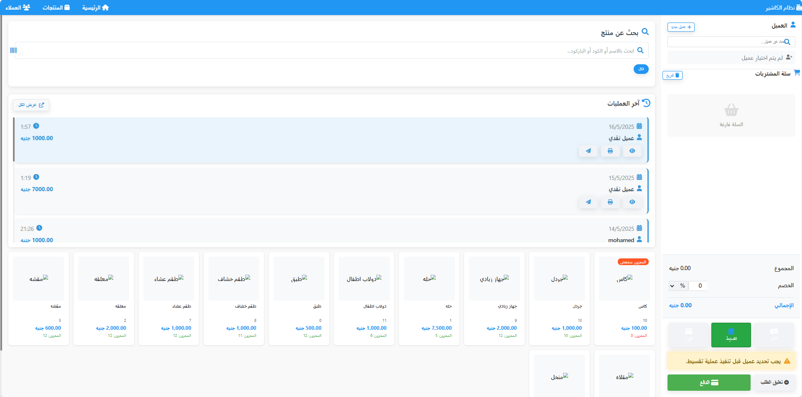
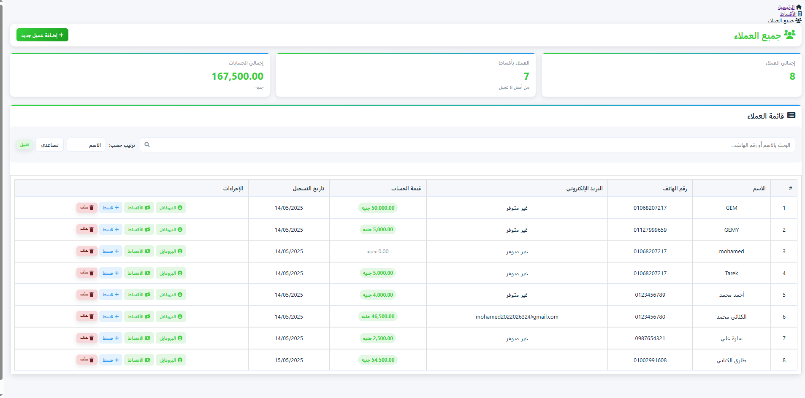
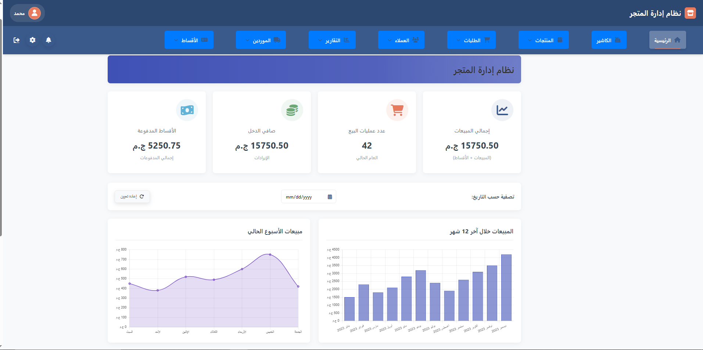
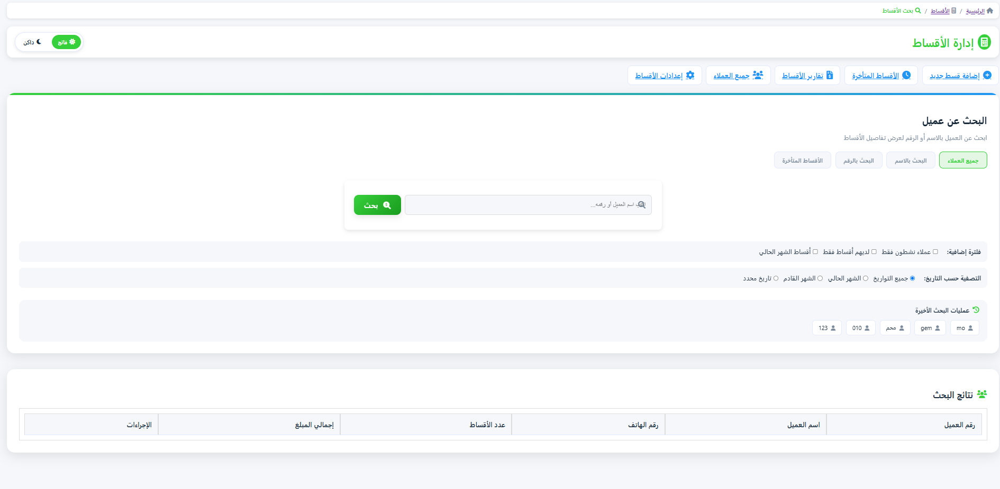
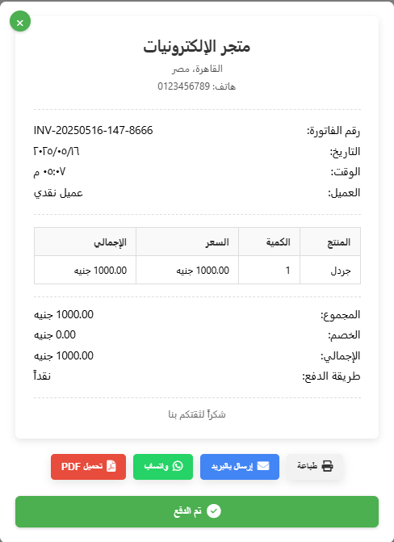
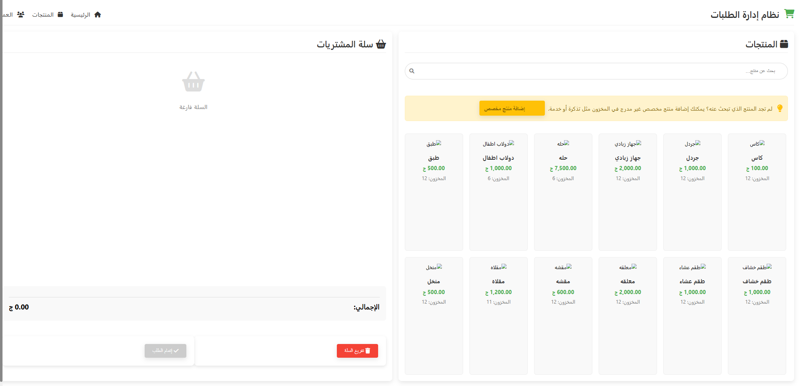

# نظام الكاشير العربي (Arabic POS System)

نظام نقاط البيع المصمم خصيصًا للمحلات والشركات في العالم العربي، ويتضمن دعمًا كاملًا للغة العربية ومميزات متقدمة لإدارة المبيعات والمخزون.

## المميزات الرئيسية

- واجهة مستخدم كاملة باللغة العربية
- نظام إدارة مبيعات متكامل
- نظام إدارة المخزون والمنتجات
- نظام التقسيط والأقساط
- تقارير مبيعات ومخزون تفصيلية
- لوحة تحكم لعرض الإحصائيات
- إدارة العملاء والموردين
- نظام المصروفات
- القدرة على تحويل العلميات إلى مستندات PDF
- دعم الطباعة الحرارية للفواتير

## متطلبات النظام

- PHP 7.4 أو أحدث
- MySQL 5.7 أو أحدث
- خادم ويب (Apache أو Nginx)
- متصفح حديث يدعم JavaScript

## التثبيت

1. قم بنسخ المشروع إلى دليل خادم الويب المحلي الخاص بك.
2. انتقل إلى الدليل `database` وقم بتشغيل ملف `setup_database.sql` على قاعدة البيانات الخاصة بك.
3. قم بتعديل ملف `app/db.php` بمعلومات الاتصال الخاصة بقاعدة البيانات.
4. افتح المتصفح وانتقل إلى عنوان المشروع.

## هيكل المشروع

```
project-root/
│
├── app/                      # ملفات PHP الأساسية
│   ├── db.example.php        # ملف الاتصال بقاعدة البيانات
│   ├── main.php              # ملف تهيئة النظام الرئيسي
│   ├── api/                  # ملفات API والعمليات
│   │   ├── save-transaction.php  # حفظ المعاملات
│   │   ├── save_sale.php     # حفظ المبيعات
│   │   └── ...
│   └── includes/             # ملفات التضمين المشتركة
│       ├── sidebar.php       # القائمة الجانبية
│       ├── topbar.php        # الشريط العلوي
│       └── ...
│
├── views/                    # صفحات النظام
│   ├── cashier.php           # صفحة الكاشير
│   ├── customers.php         # إدارة العملاء
│   ├── categories.php        # إدارة التصنيفات
│   ├── installments.php      # إدارة التقسيط
│   ├── forms/                # نماذج الإضافة والتعديل
│   │   ├── add_customer.php  # إضافة عميل
│   │   ├── edit_product.php  # تعديل منتج
│   │   └── ...
│   └── ...
│
├── assets/                   # الأصول والملفات الثابتة
│   ├── js/                   # ملفات JavaScript
│   │   ├── cashier.js        # سكريبت الكاشير
│   │   ├── transactions.js   # سكريبت المعاملات
│   │   └── ...
│   ├── css/                  # ملفات CSS
│   │   ├── styles.css        # التنسيقات الرئيسية
│   │   ├── cashier.css       # تنسيقات الكاشير
│   │   └── ...
│   └── img/                  # الصور والأيقونات
│       ├── empty-chart.svg   # رسومات فارغة للمخططات
│       └── ...
│      
├── .gitignore                # ملفات مستثناة من Git
├── README.md                 # توثيق المشروع
└── index.php                 # صفحة البداية
```

## الاستخدام

1. قم بتسجيل الدخول باستخدام اسم المستخدم وكلمة المرور.
2. استخدم القائمة الجانبية للتنقل بين أقسام النظام.
3. شاشة الكاشير تسمح بإجراء عمليات البيع وإصدار الفواتير.
4. يمكن إضافة العملاء والمنتجات والتصنيفات من خلال الصفحات المخصصة.
5. يمكن إنشاء وإدارة مبيعات التقسيط من خلال قسم الأقساط.

## 🖼️ System Preview

| Cashier Screen | Customers Management | Dashboard |
|----------------|----------------------|-----------|
|  |  |  |

| Installments | Invoice | Login |
|--------------|---------|-------|
|  |  |  |

| Orders | Products |
|--------|----------|
|  |  |


## الصيانة والتطوير

- استخدم ملفات في مجلد `database/migrations/` لتطبيق تحديثات على هيكل قاعدة البيانات.
- قم بفحص ملفات السجل في حالة وجود أي أخطاء.
- راجع أكواد JavaScript في مجلد `assets/js/` لتخصيص وظائف واجهة المستخدم.

## المساهمة

هذا المشروع مخصص لأغراض العرض فقط ضمن معرض الأعمال (Portfolio)،  
ولا يستقبل مساهمات حاليًا أو طلبات تعديل على الكود.


## الترخيص

هذا المشروع مرخص بموجب [ترخيص MIT](LICENSE). 


>
